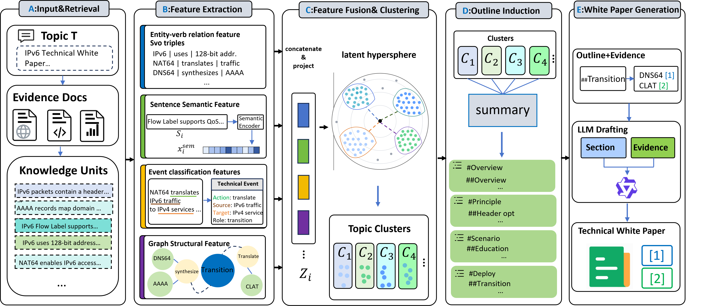

# TWP-Gen

English | [简体中文](README.zh-CN.md)

Official implementation of **Technical White Paper Generation via Multidimensional
Feature Fusion**.

TWP-Gen is a bottom-up framework that converts retrieved evidence into traceable
predicate--object knowledge units, represents them with four complementary views,
clusters related evidence, induces an evidence-grounded outline from an 11-function
white-paper taxonomy, and generates each section with source-linked citations.



*The five stages are: (A) evidence retrieval and knowledge-unit construction;
(B) multidimensional feature extraction; (C) feature fusion and clustering;
(D) evidence-grounded outline induction; and (E) citation-supported generation.*

## At a glance

| Component | What TWP-Gen does | Main output |
|---|---|---|
| Knowledge collection | Retrieves topic-related materials and preserves source metadata | `dataset/<topic>/corpus.txt` and source records |
| Knowledge-unit modeling | Extracts predicate--object units and four conceptual feature views | Per-topic feature artifacts |
| Evidence clustering | Fuses normalized views and refines 60 topic clusters | `dataset/<topic>/clusters_/` |
| Outline induction | Maps supported clusters to an 11-function section taxonomy | `dataset/<topic>/outline.txt` |
| Article generation | Drafts sections from their own evidence and binds citations | Article, references, and diagnostics |
| Evaluation | Scores ten metrics in three groups and aggregates repeated runs | JSON, CSV, Markdown, and figures |

## Paper-to-code mapping

The paper defines four **conceptual views**. The first view is implemented with two
internal branches, so the implementation uses five tensors without changing the
four-view method described in the paper.

| Paper view | Implementation artifact | Role |
|---|---|---|
| Entity--verb relation | `vs_emb` + `oh_emb` | Predicate-sense and object-head sub-branches jointly form the first view |
| Sentence semantics | `summarized_emb` | Contextual meaning of the compressed evidence sentence |
| Event function | `event_emb` | Functional/event-level information |
| Graph structure | `sents_graph_emb` | Structural relations learned from the evidence graph |

Other settings shared by the paper and code:

| Item | Paper setting | Code location |
|---|---:|---|
| Number of technical-white-paper clusters | `k = 60` | `outline_generator/run_twpgen.py` |
| Clustering-loss weight | `gamma = 5` | `outline_generator/run_twpgen.py` |
| Fusion method | Element-wise sum | `outline_generator/spherical_topic_clustering.py` |
| Conceptual feature views | 4 | Five internal tensors mapped above |
| Section taxonomy | 11 functions | `outline_generator/generate_whitepaper_outline.py` |
| Evaluation protocol | 10 metrics, 3 groups, 3 repeated runs | `dataset/evaluation/` |

### Section taxonomy

Overview, Background, and Conclusion and Outlook are core sections. The other
functions are instantiated only when one or more evidence clusters support them.

| ID | Section function | Activation |
|---:|---|---|
| 1 | Overview | Core |
| 2 | Background | Core |
| 3 | Solution and Objectives | Evidence-dependent |
| 4 | Architecture Design | Evidence-dependent |
| 5 | Methodological Principles | Evidence-dependent |
| 6 | Application Scenarios | Evidence-dependent |
| 7 | Technical Implementation | Evidence-dependent |
| 8 | Evaluation and Experiments | Evidence-dependent |
| 9 | Security and Compliance | Evidence-dependent |
| 10 | Conclusion and Outlook | Core |
| 11 | Appendix | Evidence-dependent |

Clusters that cannot be assigned confidently do not create a standalone section;
their summaries remain available as document-level context for the three core
sections, matching the paper's formulation.

## Repository layout

```text
TWP-Gen/
├── assets/                         Method figure used above
├── dataset/
│   ├── whitepaper_topics.json      60 tasks and eight domain labels
│   ├── whitepaper_topics.txt       One title per line for batch execution
│   └── evaluation/                 Ten-metric LLM evaluation implementation
├── experiments/
│   ├── cluster_number/             k-sensitivity experiment
│   ├── duee/                       DuEE metrics and algorithm comparison
│   ├── run_feature_ablation.py     Feature-view ablation launcher
│   ├── ablation_analysis.py        Ablation result aggregation
│   ├── statistical_significance.py Paired Wilcoxon, Holm, and confidence intervals
│   └── domain_analysis.py          Eight-domain aggregation
├── knowledge_collector/            Retrieval and source collection
├── outline_generator/              Knowledge units, feature fusion, clustering, outline
├── article_generator/              Evidence-grounded article generation
├── scripts/run_twpgen_pipeline.sh  End-to-end runner
├── twpgen_settings.py              Central configuration loader
└── twpgen_config.example.json      Secret-free configuration template
```

Large corpora, model checkpoints, generated features, logs, and output documents
are intentionally excluded. The corresponding runtime directories are Git-ignored.

## Installation

Linux and Python 3.10+ are recommended. CUDA is required for the full neural
feature and clustering pipeline.

```bash
git clone https://github.com/yesmolaggb/TWP-Gen.git
cd TWP-Gen
pip install -r requirements.txt

cp .env.example .env
cp twpgen_config.example.json twpgen_config.json
```

Place credentials only in `.env`; both `.env` and `twpgen_config.json` are ignored
by Git. The central resolution order is:

```text
environment variable > twpgen_config.json > built-in default
```

Inspect all resolved paths and model settings before a long run:

```bash
python twpgen_settings.py
python twpgen_settings.py --shell
```

### Main environment variables

| Variable | Purpose | Required when |
|---|---|---|
| `OPENAI_API_KEY` | Key for an OpenAI-compatible LLM endpoint | Outline generation, article generation, or evaluation |
| `OPENAI_BASE_URL` | OpenAI-compatible endpoint | Using a hosted or local compatible service |
| `TWPGEN_LLM_MODEL` | Default model served by that endpoint | Any LLM stage |
| `TAVILY_API_KEY` / `TAVILY_API_KEYS` | One key or a key pool for web retrieval | Tavily retrieval is enabled |
| `TWPGEN_TAVILY_KEY_FILE` | File containing one Tavily key per line | File-based key-pool configuration |
| `ARTICLE_LLM_MODEL` | Optional article-generation model override | Generator differs from the default model |
| `ARTICLE_ENABLE_THINKING` | Enables model reasoning when supported | Reproducing a reasoning-enabled generator |
| `TWPGEN_TOPIC_FILE` | Batch topic list | Overriding `dataset/whitepaper_topics.txt` |

Model paths, runtime environments, resource dictionaries, output directories, and
hyperparameters are configured once in `twpgen_config.json`.

## Running TWP-Gen

### End-to-end execution

The default topic list is `dataset/whitepaper_topics.txt`, which contains all 60
paper tasks. The runner keeps per-topic state and logs so interrupted topics can be
resumed.

```bash
bash scripts/run_twpgen_pipeline.sh
```

To run a smaller list, point `TWPGEN_TOPIC_FILE` to another one-title-per-line file.

### Generate articles from prepared outlines

Use this when retrieval, clustering, and outline induction have already completed:

```bash
python article_generator/src/post_outline/run_postoutline_experiment.py \
  --outline-root dataset \
  --source-root knowledge_collector/result \
  --output-root output/post_outline \
  --limit 5
```

`--limit 0` (the default) processes every configured topic. Use one or more
`--topic "<title>"` options to select exact topics. Add `--overwrite` to regenerate
existing articles.

### Output structure

```text
output/post_outline/
├── article/<topic>.md          Generated white paper
├── references/<topic>.json     Cited source titles, URLs, and excerpts
├── diagnostics/<topic>.json    Citation and grounding diagnostics
├── run_manifest.json           Per-topic status
└── run_summary.json            Model, mode, duration, and run summary
```

## Dataset

`dataset/whitepaper_topics.json` contains the 60 Chinese technical-white-paper
generation tasks used in the paper. Domain labels are used only for grouping and
reporting.

| Domain | Topics |
|---|---:|
| Networking and Internet protocols | 16 |
| AI and intelligent computing | 11 |
| Mobile communications (5G/6G) | 7 |
| Cybersecurity and trust | 7 |
| Industrial and sector applications | 6 |
| Cloud, data center and storage | 5 |
| Multimedia, sensing and XR | 4 |
| Energy and sustainable infrastructure | 4 |
| **Total** | **60** |

Runtime evidence, proprietary/large corpora, model weights, and generated documents
are not redistributed. See [dataset/README.md](dataset/README.md) for the task schema.

## Evaluation

The automatic protocol scores ten metrics on a 0--5 scale. The evaluator receives
an anonymized article. For Evidence Credibility it additionally receives citation
statistics, cited passage--source-excerpt pairs, source titles and URLs, and uncited
article excerpts.

| Group | Metrics |
|---|---|
| Content Quality | Relevance, Breadth, Depth, Novelty |
| White-Paper Adaptability | Technical Specificity, Understandability, Structurality |
| Evidence Credibility | Citation Sufficiency, Citation Validity, Factual Consistency |

```bash
python dataset/evaluation/evaluate_topics.py \
  --article-dir output/post_outline/article \
  --reference-dir output/post_outline/references \
  --diagnostic-dir output/post_outline/diagnostics \
  --output output/evaluation/scores.json \
  --repeats 3 \
  --resume

python dataset/evaluation/run_summary.py \
  --results-root output/evaluation \
  --backbone 32b
```

When `article`, `references`, and `diagnostics` are sibling directories, the latter
two are detected automatically.

## Reproducing the paper analyses

The scripts below are executable experiment entry points. Some require intermediate
features or scored baseline outputs that are too large or not licensed for release.

| Analysis | Command | Required local input | Main output |
|---|---|---|---|
| Cluster-number sensitivity | `python experiments/cluster_number/run_sensitivity.py --dataset-root dataset --topics-file dataset/whitepaper_topics.json --k 20 30 40 50 60 70 80` | Per-topic `clusters_/embed_0.pt` | CSV/JSON and figure |
| DuEE clustering algorithms | `python experiments/duee/compare_clustering_algorithms.py --input <arrays.npz> --output-dir output/duee_algorithms` | NPZ with `labels` and `gesi_embeddings` | ARI/NMI/ACC/B³ F1 table |
| Feature-view runs | `python experiments/run_feature_ablation.py --topic <topic> --dataset-root dataset` | Prepared per-topic feature bank | Variant run manifest |
| Ablation aggregation | `python experiments/ablation_analysis.py --results-root <eval-root> --backbone 32b` | Completed variant scores | JSON/CSV/Markdown |
| Statistical significance | `python experiments/statistical_significance.py --results-root <eval-root> --backbone 32b` | Topic-level paired scores | Wilcoxon/Holm table and CI figure |
| Cross-domain analysis | `python experiments/domain_analysis.py --results-root <eval-root> --topics dataset/whitepaper_topics.json --backbone 32b` | Topic-level scores | Eight-domain table |

For DuEE, the repository implements standard ARI, NMI, optimal one-to-one Hungarian
ACC, and B³ F1. All four values are reported after multiplication by 100; higher is
better.

## Results reported in the paper

The following compact table mirrors the paper's overall comparison. `Avg.` is the
unweighted mean of the ten metrics.

| Generator | Evaluator | TWP-Gen Avg. | Best baseline Avg. | Improvement |
|---|---|---:|---:|---:|
| Qwen3-14B, reasoning disabled | Qwen3-32B | **4.39** | 4.09 | +0.30 |
| Qwen3-32B, reasoning enabled | Qwen3-32B | **4.49** | 4.14 | +0.35 |
| Qwen3-32B, reasoning enabled | DeepSeek-V3 | **4.43** | 4.11 | +0.32 |

On the 1,011-instance DuEE controlled subset, the multidimensional representation
achieves 50.55 ARI, 73.94 NMI, 58.19 ACC, and 67.21 B³ F1, compared with 34.03,
56.33, 47.54, and 53.82 for sentence semantics alone. Paired comparisons over the
60 white-paper topics yield Holm-adjusted Wilcoxon `p < 0.001`; against the strongest
baseline, the mean difference is 0.354 with a 95% confidence interval of
`[0.275, 0.428]`.

## Reproducibility notes

- Random seeds and experiment-specific parameters are exposed by the experiment
  scripts; use `--help` on any entry point for the full interface.
- The same central configuration is imported by retrieval, outline, generation, and
  evaluation code. Do not add machine-specific paths or keys directly to modules.
- Generated outputs and large intermediate artifacts are deliberately excluded from
  Git. Their expected locations are documented above and in each script's help text.
- The source code is available at <https://github.com/yesmolaggb/TWP-Gen>.
